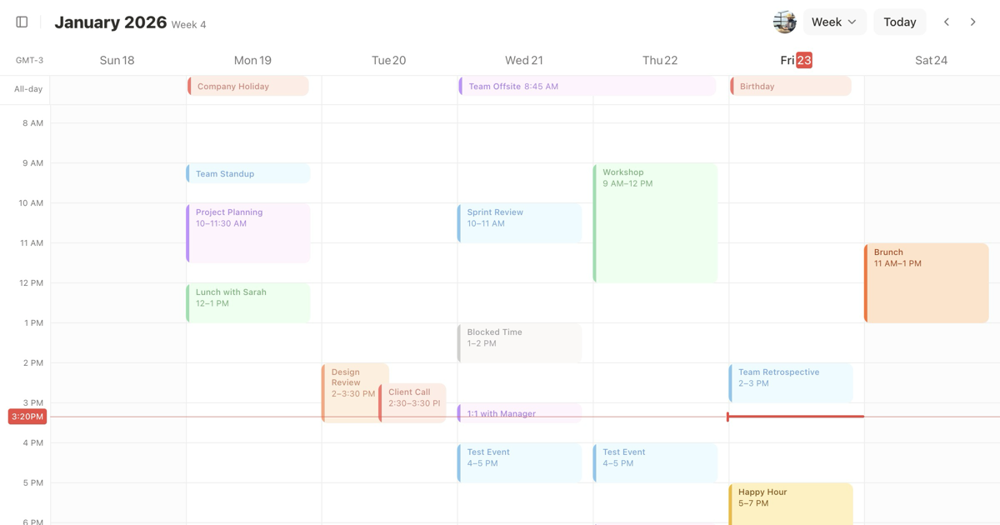

# CalendarCN

A beautifully crafted, open source calendar component for React. Built with [shadcn/ui](https://ui.shadcn.com), inspired by [Notion Calendar](https://www.notion.so/product/calendar).



**[Live Demo](https://calendarcn.vercel.app)**

## Features

- **Week View** - Full week calendar with time slots
- **Dark Mode** - Seamless light/dark theme support
- **Event Colors** - Multiple event color options (red, orange, yellow, green, blue, purple, gray)
- **All-Day Events** - Support for all-day and multi-day events
- **Current Time Indicator** - Visual indicator for current time
- **Responsive Sidebar** - Collapsible calendar sidebar with mini calendar
- **Calendar Management** - Multiple calendar support with visibility toggles
- **Keyboard Shortcuts** - Navigate efficiently with keyboard shortcuts

## Tech Stack

- [Next.js 16](https://nextjs.org/) - React framework
- [React 19](https://react.dev/) - UI library
- [Tailwind CSS 4](https://tailwindcss.com/) - Styling
- [shadcn/ui](https://ui.shadcn.com/) - UI components
- [date-fns](https://date-fns.org/) - Date utilities
- [Lucide React](https://lucide.dev/) - Icons

## Getting Started

### Prerequisites

- Node.js 22+ (see `.nvmrc`)
- [pnpm 9+](https://pnpm.io/)

### Installation

1. Clone the repository:

```bash
git clone https://github.com/vmnog/calendarcn.git
cd calendarcn
```

2. Install dependencies:

```bash
pnpm install
```

3. Run the development server:

```bash
pnpm dev
```

4. Open [http://localhost:3000](http://localhost:3000) in your browser.

## Project Structure

```
src/
├── app/                    # Next.js app router
├── components/
│   ├── ui/                 # shadcn/ui components
│   ├── week-view.tsx       # Main week view component
│   ├── week-view-*.tsx     # Week view sub-components
│   ├── calendar-event-item.tsx  # Event rendering
│   ├── calendars.tsx       # Calendar list sidebar
│   ├── date-picker.tsx     # Mini calendar picker
│   └── sidebar-*.tsx       # Sidebar components
├── hooks/                  # Custom React hooks
└── lib/                    # Utilities and helpers
```

## Keyboard Shortcuts

| Shortcut | Action |
|----------|--------|
| `T` | Go to today |
| `J` / `ArrowLeft` | Previous week |
| `K` / `ArrowRight` | Next week |
| `/` | Toggle context panel |
| `⌘ + /` | Toggle calendar sidebar |

## Contributing

Contributions are welcome! Please read the [Contributing Guide](./CONTRIBUTING.md) to get started.

## Roadmap

See [ROADMAP.md](./ROADMAP.md) for the full roadmap.

## License

[MIT License](./LICENSE) - feel free to use this in your own projects!

## Credits

- Design inspired by [Notion Calendar](https://www.notion.so/product/calendar)
- Built with [shadcn/ui](https://ui.shadcn.com/) components
- Created by [Victor Nogueira](https://vmnog.com)

## Links

- [Live Demo](https://calendarcn.vercel.app)
- [Twitter/X](https://x.com/mevmnog)
